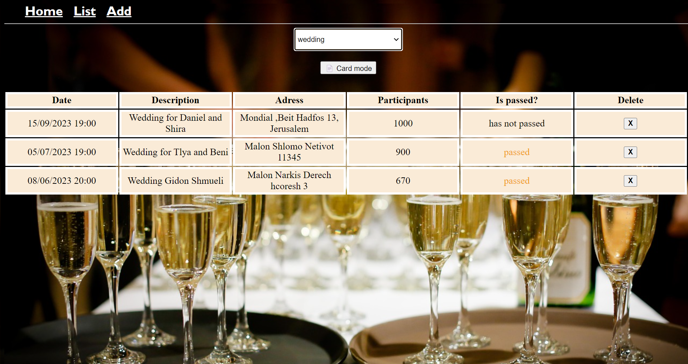
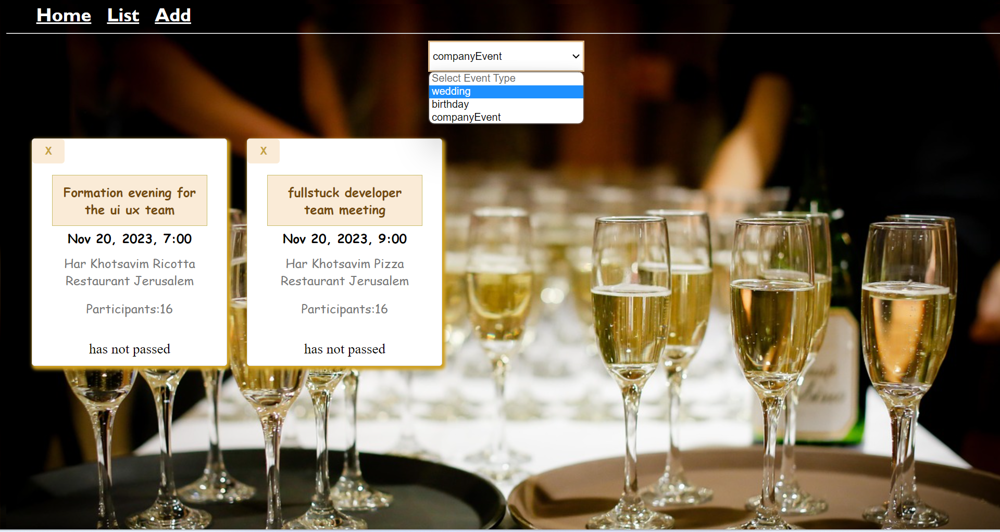
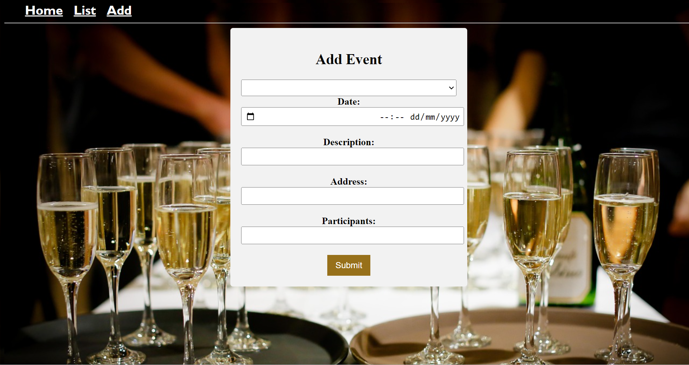

# Event Management System

This project is a web application built using Angular, MongoDB, and Node.js, designed to manage events with ease.

## Features

- Easily manage events at the push of a button.
- Select event types to filter and view specific event details.
- Add new events to the system.
- Delete existing events from the system.

## Technologies Used

- Angular: A powerful JavaScript framework for building dynamic web applications.
- MongoDB: A flexible and scalable NoSQL database for efficient data storage and retrieval.
- Node.js: A server-side runtime environment for executing JavaScript code.

## Installation

1. Clone the repository: `git clone [repository-url]`
2. Navigate to the project directory: `cd event-management-system`
3. Install the dependencies: `npm install`

## Usage

1. Start the MongoDB server.
2. Run the Node.js server: `npm start`
3. Open your web browser and access the application at: `http://localhost:3000`

## Screenshots

- Home Page: 
- Events List (Table): 
- Events List (Cards): 
- Add Event Form: 

